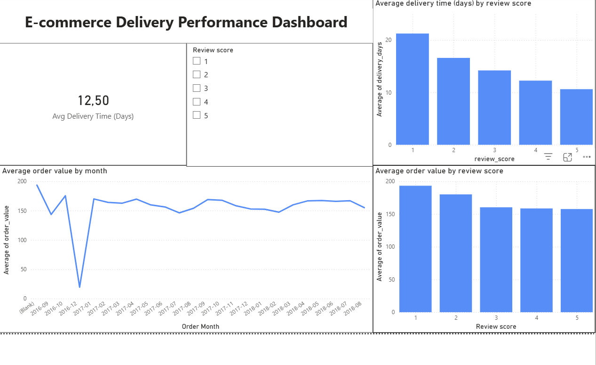
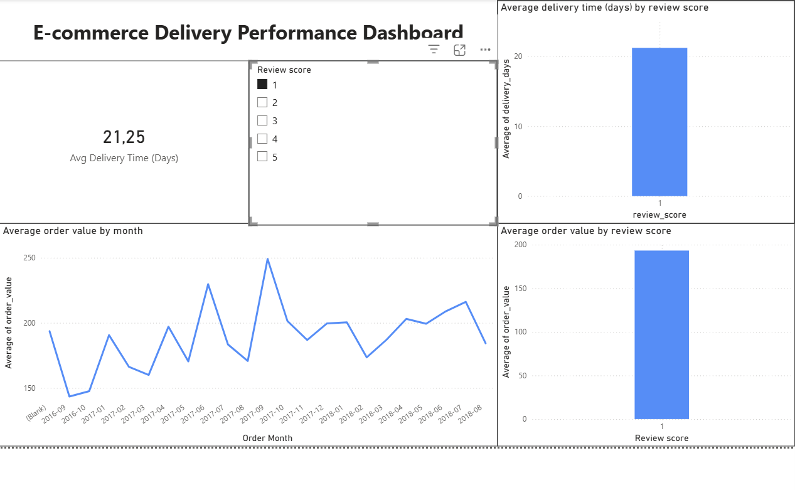

# E-commerce Delivery Performance Analysis

This project was created as part of my Data Science studies to demonstrate practical skills in SQL, data analysis and business intelligence.

The goal of the analysis was to investigate whether delivery performance impacts customer satisfaction, and how this relates to business value.

---

## Business Question
Do delivery delays negatively affect customer reviews, and can this influence revenue?

---

## Dataset
The analysis uses the public **Olist Brazilian E-commerce dataset**, containing ~100,000 real online orders including timestamps, prices and customer reviews.

Dataset link:
https://www.kaggle.com/datasets/olistbr/brazilian-ecommerce

---

## Tools Used
- **SQL Server** – data cleaning, joins, aggregations and feature engineering
- **Python (Pandas)** – data ingestion into the database
- **Power BI** – dashboard creation and data visualization

---

## Key Analysis Steps
1. Loaded raw transactional data into SQL Server
2. Created an analysis table containing delivered orders
3. Converted timestamps into proper datetime columns
4. Engineered a delivery time feature (`delivery_days`)
5. Joined customer reviews and calculated order value
6. Built an interactive Power BI dashboard

---

## Key Findings
- Long delivery times are strongly associated with negative customer reviews
- 1★ reviews: ~21 average delivery days
- 5★ reviews: ~10 average delivery days
- Large orders appear more sensitive to delivery delays

---

## Business Insight
Delivery reliability appears to be a major driver of customer satisfaction.  
Improving delivery speed and consistency would likely reduce negative reviews and stabilize customer experience.

---

## Technical Skills Demonstrated
- SQL joins and aggregations
- Feature engineering in SQL Server
- Data cleaning and transformation
- Data modeling in Power BI
- DAX measures and calculated columns
- Building interactive dashboards

---

## Dashboard Preview

### Overview

### Delivery Performance vs Customer Satisfaction

### Filtering Example

---

## Repository Structure

sql/ SQL -  Analysis queries
notebooks/ - Data loading scripts
powerbi/  - Dashboard screenshots
README.md - Project description

sql/ SQL analysis queries
notebooks/ Data loading scripts
powerbi/ Dashboard screenshots
README.md Project description